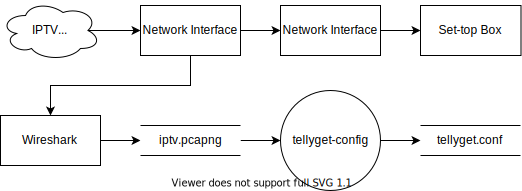
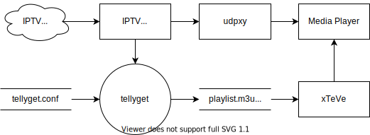

# TellyGet

A toolset for fetching and updating m3u playlist and xmltv guide from the IPTV network.

## Background

### Disadvantages of IPTV Set-top Boxes

IPTV set-top boxes are fully controlled by the service providers, and users do not have the freedom to do what they
want, like:

- Removing unwanted TV channels (e.g., advertising channels and shopping channels)
- Playback on their favorite media player (e.g., Kodi and Plex) for extra features like:
    - Stopping parents from getting confused by two remotes (one for set-top box and one for TV), and controlling the
      playback only with the TV remote
    - Time shifting without VIP
    - Recording the programs
    - Playback on multiple TVs at the same time without purchasing extra set-top boxes
    - Playback on multiple smart devices (e.g., phones, tablets and computers) at the same time
    - Even playback outside home

And you can achieve all of them above, once you got TellyGet and these applications:

- Wireshark and tshark
- xTeVe
- udpxy
- media players which supports xTeVe (e.g., Kodi and Plex)

### How TellyGet Works

TellyGet consists of two executable scripts:

- tellyget-config: Parsing the network packets sent by the set-top box and generating the config file for tellyget
- tellyget: Using the config file to imitate the set-top box's booting and channel fetching behavior

Here is the data flow for tellyget-config:



As we can see, tellyget-config:

- parses the pcapng file captured by Wireshark during the set-top box booting
- generates the config file for tellyget from the parsed information
- runs once and for all

And here is the data flow for tellyget:



As we can see, tellyget:

- independently runs on a different setup where the set-top box is absent
- fetches and updating m3u playlist and xmltv guide from the IPTV network
- Supposed to run regularly (e.g., every day)

## Compatibility

### Service Provider Compatibility

TellyGet is compatible only with China Telecom as the IPTV service provider.

### Set-top Box Compatibility

TellyGet is currently tested on these set-top boxes:

- 华为悦盒 EC6108V9

## Hardware Requirements

tellyget is recommended to run on a router or a family server (we will refer to both of them as "the router"
below) for working all the time. If you run it on a family server, two network ports (which means two physical network
interface) at least on this server are recommended, in case you want this server to connect to the IPTV network and the
network called "the Internet" at the same time.

tellyget-config can run on the router mentioned above or any other machine separately (we will refer to this machine
as "the config machine").

## Install

### Install External Dependencies

On the config machine, you should install this dependency first:

- tshark: usually installed alongside with Wireshark (add it to PATH environment variable after installation)

### Install TellyGet

Currently, tellyget-config and tellyget are always installed together. So, if your config machine and the router are not
the same machine, you must install them on both of the machines separately.

Use this command to install TellyGet from PyPI:

```shell
pip3 install tellyget
```

### Install Other Applications

On the router, install other applications if you have not:

- udpxy
- xTeVe
- media players which supports xTeVe (e.g., Kodi and Plex)
    - If you install Kodi, you also have to install the "PVR IPTV Simple Client" add-on for it

## Usage

### Capture the Network Packets

There are many ways to capture the network packets during the set-top box booting. Here I give you the method I use:

- Configure the router (mine runs OpenWrt) and bridge two physical interfaces
- Connect one interface to the modem
- Connect the other one to the turned off set-top box
- Use the "SSH remote capture" function of Wireshark to capture the network packets
- The "Remote interface" options is set to either of the two interfaces mentioned above
- Turn on the set-top box and wait for it booting to its home screen
- Save the packets to a pcapng file (mine is named to iptv.pcapng)
- Disconnect and the set-top box
- Now the router's configuration is useless, so restore it if you don't want to waste those ports

### Generate the Config File for tellyget

Find out the mac address of your set-top box at the bottom of it, and we will call it `<stb_mac>`.

On the config machine, use this command to generate the config file for tellyget:

```shell
tellyget-config iptv.pcapng <stb_mac> /etc/tellyget/tellyget.conf
```

### Connect to the IPTV Network

In order to connect to the IPTV network without the set-top box, you need to create a network interface on the router.
Use the hint given by tellyget-config at the end of its execution to accomplish that. And OpenWrt naming are used in the
hint to help you to identify the meaning of the fields.

The type of the network interface mentioned above is call "logical network interface" in OpenWrt (here we call it "IPTV
logical network interface"), and is assigned to one or multiple physical network interface. In our case, assigning it to
one is enough (here we call it "IPTV physical network interface").

Before connecting the IPTV physical network interface to the modem, there are a couple of things you need to know:

The IPTV network and the Internet are different networks in many ways, and they are supposed to be separated from each
other. In fact, they cannot work together because of the overlapping IP addresses. But don't worry. On one hand, udpxy
(its configuration will be explained later) and the tellyget script you are about to execute is bound to the IPTV
physical network interface, so they will never send any packets to the Internet. On the other hand, you should set a
higher metric on the IPTV logical network interface than your WAN interface (which is connected to the Internet) to
ensure the packets intended for the Internet would not be sent to the IPTV physical network interface.

Now connect the IPTV physical network interface to the modem, as if your router is the set-top box. And when you see an
IP address is successfully assigned on that interface, you are good to go.

### Fetch m3u Playlist and xmltv Guide

Modify the config file generated by tellyget-config (which is tellyget.conf), and fill in the fields according to this:

- iptv_logical_interface: "IPTV logical network interface"
- iptv_interface: "IPTV physical network interface"
- channel_url_prefix: The udpxy service url prefix (fill in it with your router's LAN side IP address)
- channel_filters: List of filters which is used to remove matched channels by name (regular expressions are supported)
- remove_sd_candidate_channels: whether you want to remove standard definition channels if the corresponding high
  definition channels are present
- remove_empty_programme_channels: whether you want to remove the channels which have no programs
- programme_name_cleanup: fix the program names which contain unwanted characters

Upload the config file to your router, and use this command to fetch m3u playlist and xmltv guide:

```shell
tellyget /etc/tellyget/tellyget.conf
```

In order to update m3u playlist and xmltv guide, you should run tellyget regularly. You know what to do. Just add a cron
job to the router like this:

```shell
50 22 * * * tellyget /etc/tellyget/tellyget.conf &> /var/log/tellyget.log
```

The cron job above will run at 22:50 every day and write a log.

### Configure Other Applications

#### Configure udpxy

udpxy is bound to one upstream interface and one downstream interface. You should set the upstream interface to IPTV
physical network interface by filling in the "source" (Source IP/Interface) field. And you should set the downstream
interface to your LAN bridge (e.g., br-lan in OpenWrt) by filling in the "bind" (Bind IP/Interface) field.

In order to solve disconnection issue during playback, set the mcsub_renew (multicast subscription renew) value to 180.
This value works fine for me, but you can try other values.

#### Configure xTeVe

Add m3u playlist and xmltv guide fetched by tellyget to xTeVe.

Set the update time which is slightly later than the tellyget cron job, like 22:55. But notice that xTeVe does not know
time zone, and it treats the time you give as if you are in UTC. So do your math.

#### Configure Media Players

The m3u playlist and xmltv guide transformed by xTeVe are shown on the top of the xTeVe home page. Add them to media
players.

### Congratulations

Now you can lock your set-up box in the drawer and enjoy your freedom and your favorite TV channels.

## Maintainers

[William Lu](https://github.com/williamthegrey)